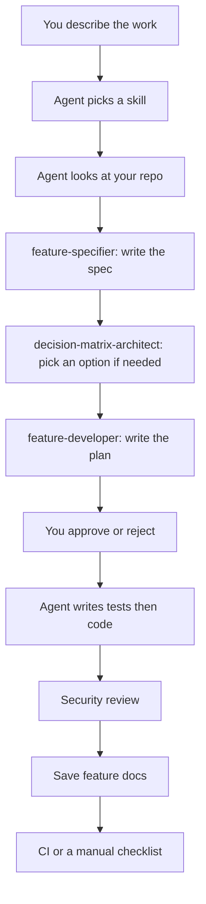

# Agent Engineer Skills

This repository teaches an AI coding agent (Cursor or Gemini) how to do software work in a repeatable way: write a spec, choose between options, implement a feature, and check security.

You do not need to be a senior engineer to use it. Copy the files into your project, ask the agent to use a skill, and review what it produces.

## Start here

If you only read one section, read this.

1. A **skill** is a written procedure the agent must follow. It is not a vibe, a persona, or a loose checklist.
2. There are four skills. Pick one from the table below, or let the agent pick from your request.
3. The agent looks at your real project (tests, CI, linters) before it plans.
4. For implementation, the agent **stops and waits** until you type an approval line. That is on purpose.
5. The agent fills templates instead of inventing random document shapes.

**Quick pick**

| You want to... | Say this | Skill |
| --- | --- | --- |
| Turn a vague idea into a clear spec | `Use skill: feature-specifier` | Write the product requirements |
| Choose between tools or designs | `Use skill: decision-matrix-architect` | Score options and write a decision record |
| Build the feature in the repo | `Use skill: feature-developer` | Plan, wait for your OK, then code with tests |
| Check security before shipping | `Use skill: sec-analyzer-tester` | Threat model and tests or a QA checklist |

A typical full path is: **specify -> decide (if needed) -> implement -> security check**.

Cursor users in this repo can start a chat with:

```text
Use skill: feature-specifier
I want users to export their invoices as CSV.
```

Details for Gemini and Cursor are in [Integration and Usage](#integration-and-usage). How the machinery works is in [docs/ARCHITECTURE.md](docs/ARCHITECTURE.md).

## Words used in this repo

These terms show up often. They are ordinary software ideas with specific names here.

| Term | Plain meaning |
| --- | --- |
| Agent | The AI that reads the skill and does the work (Cursor Agent or a Gemini Gem). |
| Skill | A procedure plus required outputs. Main file: `skills/<name>/SKILL.md`. |
| Phase | One numbered step inside a skill. Phases run in order. The agent cannot skip them. |
| Template | A Markdown form the agent fills in. Empty sections stay in the file as `N/A`. |
| Schema | A list of required fields. If a field is unknown, the agent writes `unknown` instead of hiding it. |
| Capability Discovery | The agent inspects your repo for test commands, CI files, linters, and docs folders. It does not install tools. |
| Human gate | A hard stop. The agent waits until you approve or reject a named phase. |
| Approval token | The exact line you type, for example `APPROVED: feature-developer Phase 3`. "ok" is not enough. |
| PRD | Product Requirements Document. What to build, what not to build, and how to know it is done. |
| Gherkin | Acceptance tests in `Given / When / Then` language. Example: Given I am logged in, When I click export, Then I get a CSV. |
| ADR | Architecture Decision Record. A short document of what we chose and why. This repo uses the MADR format (Markdown ADR). |
| TDD | Test-driven development: write a failing test, write the smallest code that passes, then clean up. |
| CI / CD | Automated checks on a server (GitHub Actions, GitLab CI, and similar). If you have none, the agent uses a written QA checklist instead. |
| STRIDE | A security checklist: Spoofing, Tampering, Repudiation, Information Disclosure, Denial of Service, Elevation of Privilege. |
| Trust boundary | A place where data or control crosses from one side to another (browser to API, API to database, user to admin). |

## What you get

| Property | Plain meaning |
| --- | --- |
| Repeatable | The agent follows numbered steps and stops at the same points every time. |
| Project-aware | It uses *your* test command and *your* CI files, not a generic stack it imagined. |
| Adaptive | If you have Jest, it runs Jest. If you have no test runner, it still writes tests and a manual checklist. The steps stay. The *how* changes. |
| Reviewable | You approve the plan before code. Specs are saved in git. |
| Portable | The same skills work in Cursor (project rules) and Gemini (Custom Gems or system prompts). |

This is a reference you copy into a product repo. After that, you tell the agent to follow the skills instead of free-form chatting.

## How a full feature run works



Inside one skill, steps run top to bottom. Across skills, the usual order is specifier, then decision (only if there is a real choice), then feature-developer. Security review is either its own run, or step 5 of feature-developer.

## The four skills

| Skill | What it does | What you will see in git | Do you have to approve? |
| --- | --- | --- | --- |
| [`feature-specifier`](skills/feature-specifier/SKILL.md) | Turns a fuzzy request into a spec | PRD, in-scope / out-of-scope, questions, assumptions, Gherkin scenarios | Optional. Unanswered questions become logged assumptions. |
| [`decision-matrix-architect`](skills/decision-matrix-architect/SKILL.md) | Compares options with scores | Scoring table and a MADR decision record | Recommended before a hard-to-undo choice. |
| [`feature-developer`](skills/feature-developer/SKILL.md) | Builds the feature end to end | Folder under `docs/features/<name>/`, code, tests, freeze notes, verification | **Yes.** No code until `APPROVED: feature-developer Phase 3`. |
| [`sec-analyzer-tester`](skills/sec-analyzer-tester/SKILL.md) | Finds security issues and plans tests | Trust-boundary map, STRIDE table, fixes, automated tests or a QA checklist | Yes before accepting a serious leftover risk. |

Field lists for each skill:

- [skills/feature-developer/schema.json](skills/feature-developer/schema.json)
- [skills/feature-specifier/schema.json](skills/feature-specifier/schema.json)
- [skills/decision-matrix-architect/schema.json](skills/decision-matrix-architect/schema.json)
- [skills/sec-analyzer-tester/schema.json](skills/sec-analyzer-tester/schema.json)

The shared definition format is [schemas/skill-schema.json](schemas/skill-schema.json).

## Example: from idea to code

You want invoice CSV export.

1. `Use skill: feature-specifier` and describe the idea. Answer up to five questions (who can export, what columns, how large a file).
2. If you must choose storage or a library, `Use skill: decision-matrix-architect`.
3. `Use skill: feature-developer`. Read the plan in `docs/features/invoice-csv-export/`. If it looks right, send:

   ```text
   APPROVED: feature-developer Phase 3
   ```

4. The agent writes a failing test, then code, then a security pass, then updates docs, then runs CI or a checklist.

If the idea is already a clear spec, skip to step 3. If you only want a decision, stop after step 2.

## Rules the agent must follow

1. **Fill the form, do not invent a new shape.** Templates and schemas exist so reviews stay comparable.
2. **Look at the repo first.** Do not plan as if you had Jest if there is no Jest.
3. **Stop before irreversible work.** You approve implementation plans, accepted architecture decisions, and serious security exceptions.
4. **Tests come first when building.** If there is no test command, the agent still writes test files and says they were not run.
5. **Security is a step, not an afterthought.** It happens before docs are frozen and before verification.
6. **Save local feature docs and update shared docs in the same step.**
7. **Missing CI does not mean "skip checking."** It means "use a checklist and write down evidence."
8. **Unknowns stay visible.** They become numbered assumptions with a risk level. They are not deleted.

## What is in this repository

```
agent-engineer-skills/
  README.md                 You are here
  docs/ARCHITECTURE.md      Deeper "how it works"
  docs/features/            Where feature folders go when you implement
  schemas/skill-schema.json How a skill definition is shaped
  skills/<skill-name>/      Procedure, field list, templates
  .cursor/rules/            Cursor bindings
```

---

## Integration and Usage

This section is the setup and usage guide. Read it in order. You can skim [3.2](#32-bind-and-invoke-in-gemini-system-prompts--custom-gems) or [3.3](#33-bind-and-invoke-in-cursor-ide-cursorrules) if you only use one tool.

### 1. Concept Definition

A **skill** in this framework is a structured instruction set and an execution contract for an AI agent.

That means: the agent is not asked to "be helpful about features." It is asked to run a named procedure, fill named files, and stop at named points.

A skill is these pieces together:

| Piece | Where it lives | What it is for |
| --- | --- | --- |
| Procedure | `skills/<skill-name>/SKILL.md` | The ordered steps, stop rules, and writing rules. |
| Field list | `skills/<skill-name>/schema.json` | What must appear in the result. |
| Templates | `skills/<skill-name>/templates/` | The Markdown files the agent copies and fills. |
| Shared format | `schemas/skill-schema.json` | Checks that a skill definition is complete. |
| Cursor binding | `.cursor/rules/*.mdc` | Makes Cursor load the same rules in the IDE. |
| Gemini binding | Custom Gem instructions or a system prompt | Pastes the same rules into Gemini. |

When an agent uses a skill, it must:

1. Pick the skill from the Decision Mapping table below.
2. Read `SKILL.md` and the matching `schema.json`.
3. Inspect the current repo unless that skill says not to.
4. Produce files that match the templates and include every required field.
5. Stop at every human gate until you type a sign-off that names the gate.

If the agent summarizes the skill and then works in a different structure, it has not followed the skill.

### 2. Decision Mapping

Choose **one** primary skill for the current request. Other skills can run later. They do not replace the primary skill.

| You say something like... | Use this skill first | Often next |
| --- | --- | --- |
| "I have an idea but it is vague." | `feature-specifier` | Decision skill, then `feature-developer` |
| "Write a PRD / spec / acceptance criteria." | `feature-specifier` | `feature-developer` |
| "Is this in scope? What is out of scope?" | `feature-specifier` | Nothing, unless you then ask to build it |
| "Should we use X or Y?" | `decision-matrix-architect` | `feature-developer` after you accept the decision |
| "Write an ADR / record an architecture decision." | `decision-matrix-architect` | Nothing, unless you then ask to build it |
| "Score these options." | `decision-matrix-architect` | `feature-developer` |
| "Implement this feature end to end." | `feature-developer` | Security is already step 5 of that pipeline |
| "Plan it, then wait for my approval." | `feature-developer` | Nothing extra; step 3 is the wait |
| "Add this using TDD." | `feature-developer` | Nothing extra |
| "Threat-model this." | `sec-analyzer-tester` | `feature-developer` if code fixes are needed |
| "Find vulnerabilities and propose tests." | `sec-analyzer-tester` | `feature-developer` for the patch |
| "Write a security test plan or QA checklist." | `sec-analyzer-tester` | Nothing extra |
| "I want a spec, a decision, then the code." | `feature-specifier` first | Then `decision-matrix-architect`, then `feature-developer` |

If more than one row fits, run them in this order:

1. `feature-specifier` (the request is still fuzzy)
2. `decision-matrix-architect` (more than one real option is still open)
3. `feature-developer` (you asked for code)
4. `sec-analyzer-tester` (a standalone security pass, or step 5 if you are already in `feature-developer`)

Do not start `feature-developer` while the requirement is still fuzzy. Do not run the decision skill just to decorate a choice you already locked, unless you asked for a written record of that lock.

### 3. Integration Steps

Copy the files once into the project where you want the agent to work. Then bind either Gemini, Cursor, or both.

#### 3.1 Copy the files into your project

1. Copy `skills/`, `schemas/`, `docs/`, and `.cursor/rules/` into your project, keeping the same folder names.
2. Check that these files exist:
   - `schemas/skill-schema.json`
   - `skills/feature-developer/SKILL.md`
   - `skills/feature-specifier/SKILL.md`
   - `skills/decision-matrix-architect/SKILL.md`
   - `skills/sec-analyzer-tester/SKILL.md`
   - `.cursor/rules/agent-engineer-skills.mdc` (Cursor only)
3. Do not rename the skills. The ids stay: `feature-developer`, `feature-specifier`, `decision-matrix-architect`, `sec-analyzer-tester`.
4. Create `docs/features/` if it is missing. Implementation notes from `feature-developer` go there.

#### 3.2 Bind and invoke in Gemini (System Prompts / Custom Gems)

Gemini does not read `.cursor/rules/` from your repo. You paste the skill into a Custom Gem or into a system prompt.

**One Gem per skill (recommended)**

1. Open Google Gemini and create a Custom Gem.
2. Name it after the skill, for example `feature-developer`.
3. Paste the block below into the Gem instructions, then paste the full `SKILL.md` under it:

```text
You are executing an Agent Engineer Skill. The skill text that follows is an execution contract, not optional style guidance.

Rules:
1. Follow every phase in order. Do not skip, merge, or reorder phases.
2. Use the templates referenced by the skill. Do not invent alternate document structures.
3. Validate outputs against the skill's schema.json conceptually: every required field must appear.
4. Stop at Human Review Gates. Do not continue until the user types an explicit sign-off that names the gate, for example: "APPROVED: feature-developer Phase 3".
5. Run Capability Discovery against files the user provides or describes. If the repository is not available, state that discovery is incomplete and list the missing signals.
6. Do not use icons or emojis in any artifact.
7. If the user request is out of scope for this skill, refuse and name the correct skill from the Decision Mapping table.
```

4. Attach (or paste) that skill's `schema.json` and every file in `skills/<skill-name>/templates/`.
5. Save the Gem. Start a chat with it. Say what you want, plus a short note about the repo (language, how you run tests, whether you use GitHub Actions, and any important files).

**One dispatcher Gem (optional)**

1. Create a Gem named `agent-engineer-skills`.
2. Paste the Concept Definition, Decision Mapping table, and Usage Guardrails from this README into the Gem instructions.
3. Tell the Gem to pick exactly one primary skill, say which one, then follow that skill's `SKILL.md`.
4. Attach all four `SKILL.md` files, all four `schema.json` files, and `docs/ARCHITECTURE.md`.

**Gemini API**

1. Put `skills/<skill-name>/SKILL.md` in the system instruction.
2. If the API can take a JSON Schema, use `skills/<skill-name>/schema.json`. If not, require Markdown that still includes every required field.
3. Send repo facts first (test command, CI files, linter paths), then the user request.
4. In your app, do not send a "continue coding" turn until the user record contains `APPROVED: <skill> Phase <n>`.

**Example prompts (Gemini)**

```text
Gem: feature-specifier
User: Specify a billing export feature. Stack is TypeScript, Jest, GitHub Actions. No existing PRD.

Gem: decision-matrix-architect
User: Decide between Postgres row-level security and an application-level authorization service for multi-tenant isolation. Hard constraint: we remain on Postgres 16.

Gem: feature-developer
User: Implement the approved spec in docs/features/billing-export/. Wait for my sign-off after the architecture plan.

Gem: sec-analyzer-tester
User: Threat-model the billing export API. Trust boundaries: browser, public API, worker, object storage.
```

#### 3.3 Bind and invoke in Cursor IDE (`.cursor/rules/`)

Cursor reads project rules from `.cursor/rules/`.

**Bind**

1. Copy `.cursor/rules/` from this repository into your project's `.cursor/rules/` folder. `agent-engineer-skills.mdc` always applies. The four skill rules apply when you mention them or when the dispatcher selects them.
2. Copy `skills/` and `schemas/` into the same relative paths so the rules can open `SKILL.md`.
3. Optional: also copy each `skills/<skill-name>/` folder to `.cursor/skills/<skill-name>/` if you want Cursor skill discovery. Keep the copy under `skills/` as the one you commit.
4. Reload the Cursor window, or start a new Agent chat.

**Invoke**

Name the skill in your prompt. The agent should say which skill it is using before it starts.

```text
Use skill: feature-specifier
Turn this request into a PRD with Gherkin acceptance criteria. Ask at most five clarification questions. Log any remaining unknowns as assumptions.
```

```text
Use skill: decision-matrix-architect
Compare SQLite, PostgreSQL, and DynamoDB for the local-first sync service. Hard constraint: must run offline on desktop. Produce a MADR ADR.
```

```text
Use skill: feature-developer
Implement docs/features/offline-sync/ after Capability Discovery. Stop at Phase 3 for my sign-off.
```

```text
Use skill: sec-analyzer-tester
STRIDE the offline-sync worker. If a test framework exists, generate automated tests; otherwise produce a manual QA checklist.
```

**How you approve in Cursor**

The agent stops. You continue with a line that names the gate:

```text
APPROVED: feature-developer Phase 3
Proceed to TDD implementation.
```

To send it back:

```text
REJECTED: feature-developer Phase 3
Change the storage adapter to the existing packages/storage interface. Resubmit the architecture plan.
```

**Rule files in this repository**

| File | When it applies | Role |
| --- | --- | --- |
| `.cursor/rules/agent-engineer-skills.mdc` | Always | Picks the skill and lists global rules |
| `.cursor/rules/feature-developer.mdc` | When that skill is selected | Feature pipeline |
| `.cursor/rules/feature-specifier.mdc` | When that skill is selected | Spec pipeline |
| `.cursor/rules/decision-matrix-architect.mdc` | When that skill is selected | Decision pipeline |
| `.cursor/rules/sec-analyzer-tester.mdc` | When that skill is selected | Security pipeline |

### 4. Usage Guardrails

These rules always apply. They beat "just keep chatting."

#### When to use each skill

| Skill | Use it when |
| --- | --- |
| `feature-specifier` | The request is fuzzy, scope is unclear, people disagree on "done," or there is no spec yet. |
| `decision-matrix-architect` | Two or more real options exist, the choice is expensive to undo, or you need a written decision. |
| `feature-developer` | You want the change built, with tests, security review, docs, and verification. |
| `sec-analyzer-tester` | The work crosses a trust boundary, deals with login or permissions, handles sensitive data, opens a network interface, or you asked for a threat model. |

#### When not to use each skill

| Skill | Skip it when |
| --- | --- |
| `feature-specifier` | The spec is already clear and approved, and you only want code, a trade-off, or a threat model. Do not rewrite the spec just to stall. |
| `decision-matrix-architect` | There is only one real option, you already mandated the choice, or the choice is small and easy to undo. Do not score options after the fact unless you asked for a write-up. |
| `feature-developer` | The requirement is still fuzzy (run `feature-specifier` first), you only wanted a document, or the change is a tiny typo with no behavior change. Do not code before Phase 3 approval. |
| `sec-analyzer-tester` | The change has no security angle (comments, copy edits, internal docs with no process change). Do not run a full STRIDE show for a change that never crosses a trust boundary. |

#### Do not

1. Skip Capability Discovery when the skill includes it.
2. Continue past a gate without `APPROVED: <skill> Phase <n>` (or a clear approval that names that same gate).
3. Invent tools. If Jest is not in the repo, write `absent` or `unknown`.
4. Put icons or emojis in skill files, skill-authored commits, or docs.
5. Replace Gherkin, MADR, or STRIDE templates with a free-form essay.
6. Mark verification passed unless CI passed or every checklist item has evidence.
7. Add extra scope. Out-of-scope ideas need a new specifier run.
8. Write secrets, production passwords, or personal data into skill files.

## Versioning

Skill names do not change. Small additions bump a minor version. Removing or renaming required fields is a breaking change and must be noted in `docs/ARCHITECTURE.md`.

## License

[PolyForm Noncommercial License 1.0.0](LICENSE). Free to use, copy, change, and share for noncommercial purposes (personal, hobby, study, education, research, charity, government). Not free for commercial use. The software is provided as-is, with no warranty.
