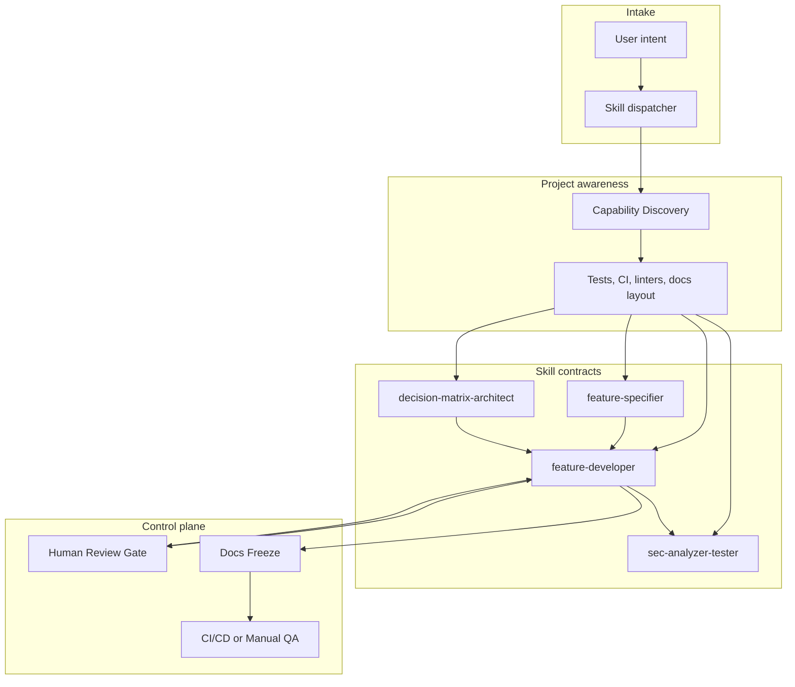

# Agent Engineer Skills

A deterministic, project-aware, and adaptive skill architecture for AI agents executing end-to-end software engineering workflows.

Agent Engineer Skills (`agent-engineer-skills`) defines executable contracts, not prompts in the informal sense. Each skill specifies phases, inputs, outputs, adaptive rules, and human-in-the-loop gates. Gemini Custom Gems and Cursor agents can bind the same contracts and produce comparable artifacts across projects.

This repository is a production-grade reference: copy the skills into a product repository, bind them in Gemini or Cursor, and require agents to follow the schemas and templates without improvising structure.

## Value Proposition

| Property | Meaning |
| --- | --- |
| Deterministic | Skills execute as ordered phases with explicit stop conditions. An agent does not skip a gate, invent a phase, or emit unstructured output when a schema exists. |
| Project-aware | Capability Discovery inspects the local repository before planning. Test runners, linters, CI pipelines, and documentation layouts drive later phases. |
| Adaptive | The same skill produces different artifacts depending on discovered capabilities. If a test framework exists, tests are generated and executed. If it does not, a structured manual QA checklist is produced. |
| Reviewable | Human Review Gates pause execution until an explicit sign-off is recorded. Architecture and product documents are frozen before implementation. |
| Portable | One contract set serves Gemini system prompts / Custom Gems and Cursor `.cursor/rules/` plus `SKILL.md` files. |

## Architecture



Execution is sequential inside a skill and compositional across skills. `feature-specifier` and `decision-matrix-architect` typically run before `feature-developer`. `sec-analyzer-tester` may run as a dedicated engagement or as Phase 5 of `feature-developer`.

The full lifecycle, discovery algorithm, and integration patterns are specified in [docs/ARCHITECTURE.md](docs/ARCHITECTURE.md).

## Skill Inventory

| Skill | Purpose | Primary artifacts | Human gate |
| --- | --- | --- | --- |
| [`feature-developer`](skills/feature-developer/SKILL.md) | End-to-end adaptive feature implementation pipeline | `docs/features/<feature-name>/` blueprint, code, tests, freeze, verification | Yes. Phase 3 requires explicit sign-off before implementation. |
| [`feature-specifier`](skills/feature-specifier/SKILL.md) | Transform ambiguous ideas into unambiguous PRDs | PRD, scope boundaries, assumption log, Gherkin acceptance criteria | Optional. Clarification questions must be answered or assumptions logged before freeze of the PRD. |
| [`decision-matrix-architect`](skills/decision-matrix-architect/SKILL.md) | Objective trade-off analysis and Architectural Decision Records | Weighted scoring matrix, MADR ADR | Recommended before irreversible architecture choices. |
| [`sec-analyzer-tester`](skills/sec-analyzer-tester/SKILL.md) | Threat modeling, mitigation, and adaptive test-plan generation | Trust-boundary map, STRIDE model, mitigations, automated tests or manual QA checklist | Recommended before shipping security-sensitive changes. |

Canonical JSON Schema for all skill definitions: [schemas/skill-schema.json](schemas/skill-schema.json).

Per-skill input/output schemas live next to each `SKILL.md`:

- [skills/feature-developer/schema.json](skills/feature-developer/schema.json)
- [skills/feature-specifier/schema.json](skills/feature-specifier/schema.json)
- [skills/decision-matrix-architect/schema.json](skills/decision-matrix-architect/schema.json)
- [skills/sec-analyzer-tester/schema.json](skills/sec-analyzer-tester/schema.json)

## Repository Layout

```
agent-engineer-skills/
  README.md
  docs/ARCHITECTURE.md
  docs/features/README.md
  schemas/skill-schema.json
  skills/<skill-name>/SKILL.md
  skills/<skill-name>/schema.json
  skills/<skill-name>/templates/
  .cursor/rules/
```

## Design Principles

1. **Contract over improvisation.** If a template or schema exists, the agent fills it. Free-form prose is allowed only in designated narrative fields.
2. **Discover before decide.** No architecture or implementation plan is issued until Capability Discovery has recorded the local toolchain.
3. **Pause at irreversible points.** Human Review Gates sit in front of code changes, ADR adoption, and security-exception acceptance.
4. **TDD when a runner exists.** Implementation writes a failing test first, then the minimum code to pass, then refactors. If no runner exists, the agent still writes tests as files and records them as unverified until a runner is introduced.
5. **Security is a phase, not a postscript.** Threat modeling and edge-case audit occur before docs freeze and CI verification.
6. **Documents freeze together.** Feature-local docs and global system docs are updated in the same phase, with a recorded diff.
7. **Adapt the output, not the contract.** Missing CI does not skip verification; it switches the verification mode to structured manual QA.
8. **No silent assumptions.** Unresolved questions become logged assumptions with an owner and a risk rating. They never disappear.

---

## Integration and Usage

This section is the operational guide for binding and invoking the skills. Read it in order.

### 1. Concept Definition

A **skill** in this framework is a structured instruction set and an execution contract for an AI agent.

It is not a slogan, a persona, or a loose checklist. A skill is the combination of:

| Component | Location | Role |
| --- | --- | --- |
| Execution procedure | `skills/<skill-name>/SKILL.md` | Ordered phases, stop conditions, formatting rules, and guardrails the agent must follow. |
| Input/output contract | `skills/<skill-name>/schema.json` | JSON Schema describing required request fields and required response artifacts. |
| Artifact templates | `skills/<skill-name>/templates/` | Markdown forms the agent instantiates rather than inventing structure. |
| Meta-schema | `schemas/skill-schema.json` | Validates that a skill definition itself is complete (metadata, phases, adaptive rules). |
| IDE binding | `.cursor/rules/*.mdc` | Cursor-native projection of the same contracts. |
| Runtime binding | Gemini system prompt or Custom Gem instructions | Copy of the skill contract injected as non-optional instructions. |

When an agent "uses a skill," it must:

1. Identify the skill from the Decision Mapping table below.
2. Read `SKILL.md` and the matching `schema.json`.
3. Run Capability Discovery against the current repository unless the skill states that discovery is not required.
4. Produce artifacts that validate against the schema and match the templates.
5. Stop at every Human Review Gate until the user records an explicit sign-off.

An agent that summarizes the skill and then proceeds in a different structure has failed the contract.

### 2. Decision Mapping

Map the user's intent to exactly one primary skill. Secondary skills may be invoked later as named phases, not as a substitute for the primary skill.

| User intent | Primary skill | Typical follow-on |
| --- | --- | --- |
| "I have an idea for a feature but it is vague." | `feature-specifier` | `decision-matrix-architect`, then `feature-developer` |
| "Write a PRD / spec / acceptance criteria for this." | `feature-specifier` | `feature-developer` |
| "Is this in scope? What is out of scope?" | `feature-specifier` | None, unless implementation is requested |
| "Should we use X or Y?" | `decision-matrix-architect` | `feature-developer` after the ADR is accepted |
| "Record an architecture decision / write an ADR." | `decision-matrix-architect` | None, unless implementation is requested |
| "Trade-off analysis / weighted scoring of options." | `decision-matrix-architect` | `feature-developer` |
| "Implement this feature end to end." | `feature-developer` | `sec-analyzer-tester` is Phase 5 of the same pipeline |
| "Build it, but plan first and wait for my approval." | `feature-developer` | None; Phase 3 is the approval gate |
| "Add this capability using TDD." | `feature-developer` | None |
| "Threat model this change / this system." | `sec-analyzer-tester` | `feature-developer` if mitigations require code |
| "Find vulnerabilities and propose tests." | `sec-analyzer-tester` | `feature-developer` for patch implementation |
| "Write a security test plan or QA checklist." | `sec-analyzer-tester` | None |
| "I want a spec, a decision, and then the code." | `feature-specifier` first | Then `decision-matrix-architect`, then `feature-developer` |

If the intent matches more than one row, run the skills in this fixed order:

1. `feature-specifier` (ambiguity remains)
2. `decision-matrix-architect` (more than one viable technical option remains)
3. `feature-developer` (implementation is requested)
4. `sec-analyzer-tester` (standalone security engagement, or Phase 5 if already inside `feature-developer`)

Do not run `feature-developer` while the product requirement is still ambiguous. Do not run `decision-matrix-architect` to justify a decision that has already been mandated as a hard constraint unless the user asks for a recorded ADR of that mandate.

### 3. Integration Steps

Complete the copy step once per consuming repository, then bind the runtime you actually use.

#### 3.1 Copy the contracts into a consuming repository

1. Clone or vendor this repository, or copy the `skills/`, `schemas/`, `docs/`, and `.cursor/rules/` directories into the consuming project at the same relative paths.
2. Confirm the following files exist:
   - `schemas/skill-schema.json`
   - `skills/feature-developer/SKILL.md`
   - `skills/feature-specifier/SKILL.md`
   - `skills/decision-matrix-architect/SKILL.md`
   - `skills/sec-analyzer-tester/SKILL.md`
   - `.cursor/rules/agent-engineer-skills.mdc` (Cursor only)
3. Do not rewrite skill names. Identifiers are stable: `feature-developer`, `feature-specifier`, `decision-matrix-architect`, `sec-analyzer-tester`.
4. Create `docs/features/` in the consuming repository if it does not exist. Feature work from `feature-developer` is written there.

#### 3.2 Bind and invoke in Gemini (System Prompts / Custom Gems)

Gemini has no project-local rules directory equivalent to `.cursor/rules/`. Binding is done by injecting the skill contract into the Gem instructions or into the chat system prompt.

**Create one Gem per skill (recommended)**

1. Open Google Gemini and create a Custom Gem.
2. Name the Gem after the skill identifier, for example `feature-developer`.
3. In the Gem instructions, paste the following preamble verbatim, then paste the full contents of the corresponding `SKILL.md` beneath it:

```text
You are executing an Agent Engineer Skill. The skill text that follows is an execution contract, not optional style guidance.

Rules:
1. Follow every phase in order. Do not skip, merge, or reorder phases.
2. Use the templates referenced by the skill. Do not invent alternate document structures.
3. Validate outputs against the skill's schema.json conceptually: every required field must appear.
4. Stop at Human Review Gates. Do not continue until the user types an explicit sign-off that names the gate, for example: "APPROVED: feature-developer Phase 3".
5. Run Capability Discovery against files the user provides or describes. If the repository is not available, state that discovery is incomplete and list the missing signals.
6. Do not use icons or emojis in any artifact.
7. If the user request is out of scope for this skill, refuse and name the correct skill from the Decision Mapping table.
```

4. Attach, or paste as additional knowledge, the skill's `schema.json` and every file under `skills/<skill-name>/templates/`.
5. Save the Gem. Invoke it by starting a chat with that Gem and stating the user intent plus repository context (language, test command, CI vendor, and relevant file excerpts).

**Use a single dispatcher Gem (optional)**

1. Create a Gem named `agent-engineer-skills`.
2. Paste the Concept Definition, Decision Mapping table, and Usage Guardrails from this README into the Gem instructions.
3. Instruct the Gem to select exactly one primary skill, announce the selection, and then follow that skill's `SKILL.md`.
4. Attach all four `SKILL.md` files, all four `schema.json` files, and `docs/ARCHITECTURE.md` as Gem knowledge.

**System prompt in a Gemini API integration**

1. Load `skills/<skill-name>/SKILL.md` as the system instruction.
2. Load `skills/<skill-name>/schema.json` as a constrained output schema if the API surface supports JSON Schema, otherwise require the model to emit Markdown artifacts that cover every required field.
3. Pass repository signals (detected test command, CI files, linter config paths) as the first user message before the actual request.
4. Enforce Human Review Gates in application code: do not send a "continue implementation" turn until the user record contains `APPROVED: <skill> Phase <n>`.

**Invocation examples (Gemini)**

```text
Gem: feature-specifier
User: Specify a billing export feature. Stack is TypeScript, Jest, GitHub Actions. No existing PRD.

Gem: decision-matrix-architect
User: Decide between Postgres row-level security and an application-level authorization service for multi-tenant isolation. Hard constraint: we remain on Postgres 16.

Gem: feature-developer
User: Implement the approved spec in docs/features/billing-export/. Wait for my sign-off after the architecture plan.

Gem: sec-analyzer-tester
User: Threat-model the billing export API. Trust boundaries: browser, public API, worker, object storage.
```

#### 3.3 Bind and invoke in Cursor IDE (`.cursor/rules/`)

Cursor binds skills through project rules and, optionally, through project skills.

**Bind**

1. Copy `.cursor/rules/` from this repository into the consuming project's `.cursor/rules/` directory. The dispatcher rule `agent-engineer-skills.mdc` is `alwaysApply: true`. Individual skill rules are `alwaysApply: false` and are pulled in by mention or by the dispatcher.
2. Copy `skills/` and `schemas/` into the consuming project at the same relative paths so the rules can point at `SKILL.md` files.
3. Optional: copy each `skills/<skill-name>/` directory into `.cursor/skills/<skill-name>/` if you want Cursor's skill discovery to load `SKILL.md` directly. Keep the canonical copy under `skills/` in version control.
4. Reload the Cursor window, or start a new Agent chat, so the rules are picked up.

**Invoke**

Use an explicit skill identifier in the agent prompt. The dispatcher rule requires the agent to announce the selected skill before executing.

```text
Use skill: feature-specifier
Turn this request into a PRD with Gherkin acceptance criteria. Ask at most five clarification questions. Log any remaining unknowns as assumptions.
```

```text
Use skill: decision-matrix-architect
Compare SQLite, PostgreSQL, and DynamoDB for the local-first sync service. Hard constraint: must run offline on desktop. Produce a MADR ADR.
```

```text
Use skill: feature-developer
Implement docs/features/offline-sync/ after Capability Discovery. Stop at Phase 3 for my sign-off.
```

```text
Use skill: sec-analyzer-tester
STRIDE the offline-sync worker. If a test framework exists, generate automated tests; otherwise produce a manual QA checklist.
```

**Sign-off format in Cursor**

The agent must stop and wait. Resume with a message that names the gate:

```text
APPROVED: feature-developer Phase 3
Proceed to TDD implementation.
```

Rejected or partial sign-off:

```text
REJECTED: feature-developer Phase 3
Change the storage adapter to the existing packages/storage interface. Resubmit the architecture plan.
```

**Rule files shipped in this repository**

| File | Apply mode | Role |
| --- | --- | --- |
| `.cursor/rules/agent-engineer-skills.mdc` | Always apply | Dispatcher, decision mapping, global guardrails |
| `.cursor/rules/feature-developer.mdc` | Apply on mention / agent request | Feature pipeline |
| `.cursor/rules/feature-specifier.mdc` | Apply on mention / agent request | PRD pipeline |
| `.cursor/rules/decision-matrix-architect.mdc` | Apply on mention / agent request | ADR pipeline |
| `.cursor/rules/sec-analyzer-tester.mdc` | Apply on mention / agent request | Security pipeline |

### 4. Usage Guardrails

These rules are mandatory. They override conversational convenience.

#### When to use each skill

| Skill | Use when |
| --- | --- |
| `feature-specifier` | The request is ambiguous, the scope is unset, stakeholders disagree on "done," or no PRD/acceptance criteria exist. |
| `decision-matrix-architect` | Two or more technically viable options remain, the choice is costly to reverse, or an ADR is required by process. |
| `feature-developer` | A specification exists or is produced in-phase, implementation is requested, and the agent will own tests, security audit, docs freeze, and verification. |
| `sec-analyzer-tester` | The work crosses a trust boundary, handles authn/authz, processes sensitive data, exposes a network interface, or the user asks for threat modeling or a security test plan. |

#### When not to use each skill

| Skill | Do not use when |
| --- | --- |
| `feature-specifier` | The PRD is already approved and unambiguous, and the user only wants code, a trade-off, or a threat model. Do not re-specify as a delay tactic. |
| `decision-matrix-architect` | There is a single viable option, the user has issued a hard mandate, or the choice is trivial and reversible with no architectural blast radius. Do not produce a matrix to retroactively justify code already written unless asked to document a decision after the fact. |
| `feature-developer` | The requirement is still ambiguous (run `feature-specifier` first), the user asked only for a document, or the change is a one-line typo/config edit with no behavioral surface. Do not start implementation before Phase 3 sign-off. |
| `sec-analyzer-tester` | The change has no security relevance (copy edits, comment-only, purely internal documentation with no process impact). Do not use STRIDE theater on changes that do not cross a trust boundary. |

#### Global prohibitions

1. Do not skip Capability Discovery when the skill lists it as a phase.
2. Do not continue past a Human Review Gate without an explicit `APPROVED: <skill> Phase <n>` (or equivalent unambiguous approval that names the gate).
3. Do not invent toolchain facts. If Jest is not present, do not claim it is. Record `unknown` or `absent`.
4. Do not emit icons or emojis in any skill artifact, commit message authored under a skill, or documentation file.
5. Do not replace Gherkin, MADR, or STRIDE templates with free-form essays.
6. Do not mark verification passed unless CI succeeded or every manual QA item is checked with evidence.
7. Do not expand scope beyond the approved In-Scope section. Out-of-scope items become a new specifier run, not silent extras.
8. Do not log secrets, production credentials, or personal data in skill artifacts.

## Versioning

Skill identifiers are stable. Additive phase changes increment the `metadata.version` field inside each skill definition. Breaking changes to input/output schemas require a major version increment and a migration note in `docs/ARCHITECTURE.md`.

## License

MIT. See [LICENSE](LICENSE).
